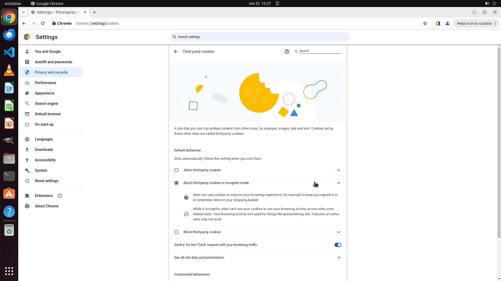

# Can you enable the 'Do Not Track' feature in Chrome to enhance my online privacy?

[← Chrome](../README.md) · [← Showcase](../../README.md)

## Task

> Can you enable the 'Do Not Track' feature in Chrome to enhance my online privacy?

## Final state

## Artifacts

- [Trajectory](traj.jsonl) — per-step actions, reasoning, and screenshots
- [Runtime log](runtime.log)
- [Task definition](task.json) — original OSWorld task config
- Step screenshots: `step_*.png` in this folder

Task ID: `030eeff7-b492-4218-b312-701ec99ee0cc` · Domain: `chrome` · Source: `https://www.surreycc.gov.uk/website/cookies/do-not-track`
