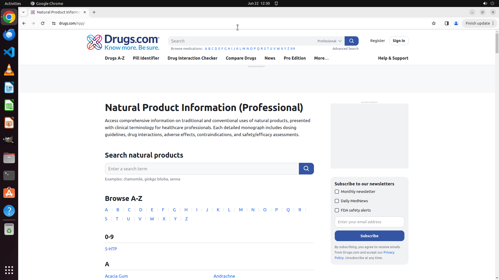

# Browse the natural products database.

[← Chrome](../README.md) · [← Showcase](../../README.md)

## Task

> Browse the natural products database.

## Final state

## Artifacts

- [Trajectory](traj.jsonl) — per-step actions, reasoning, and screenshots
- [Runtime log](runtime.log)
- [Task definition](task.json) — original OSWorld task config
- Step screenshots: `step_*.png` in this folder

Task ID: `0d8b7de3-e8de-4d86-b9fd-dd2dce58a217` · Domain: `chrome` · Source: `Mind2Web`
