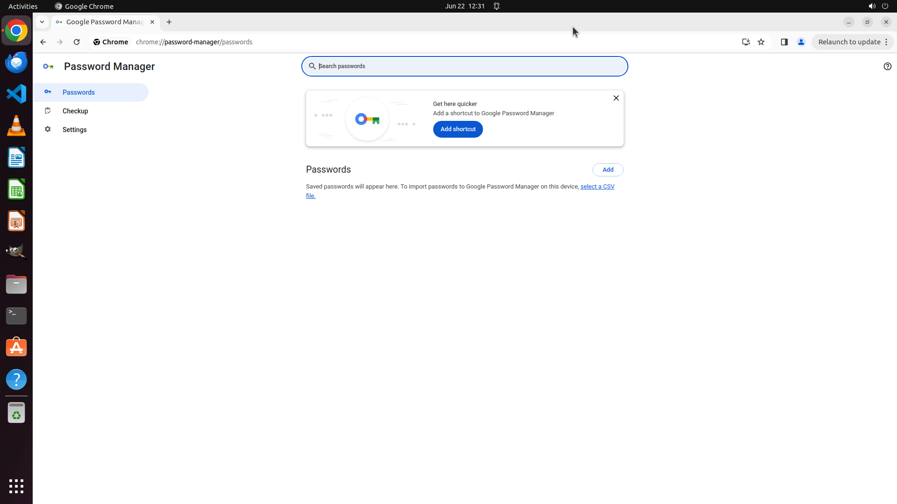

# Computer, please navigate to the area in my browser settings where my passwords are stored. I want t…

[← Chrome](../README.md) · [← Showcase](../../README.md)

## Task

> Computer, please navigate to the area in my browser settings where my passwords are stored. I want to check my login information for Etsy without revealing it just yet.

## Final state

## Artifacts

- [Trajectory](traj.jsonl) — per-step actions, reasoning, and screenshots
- [Runtime log](runtime.log)
- [Task definition](task.json) — original OSWorld task config
- Step screenshots: `step_*.png` in this folder

Task ID: `12086550-11c0-466b-b367-1d9e75b3910e` · Domain: `chrome` · Source: `https://www.quora.com/What-are-the-cool-tricks-to-use-Google-Chrome`
