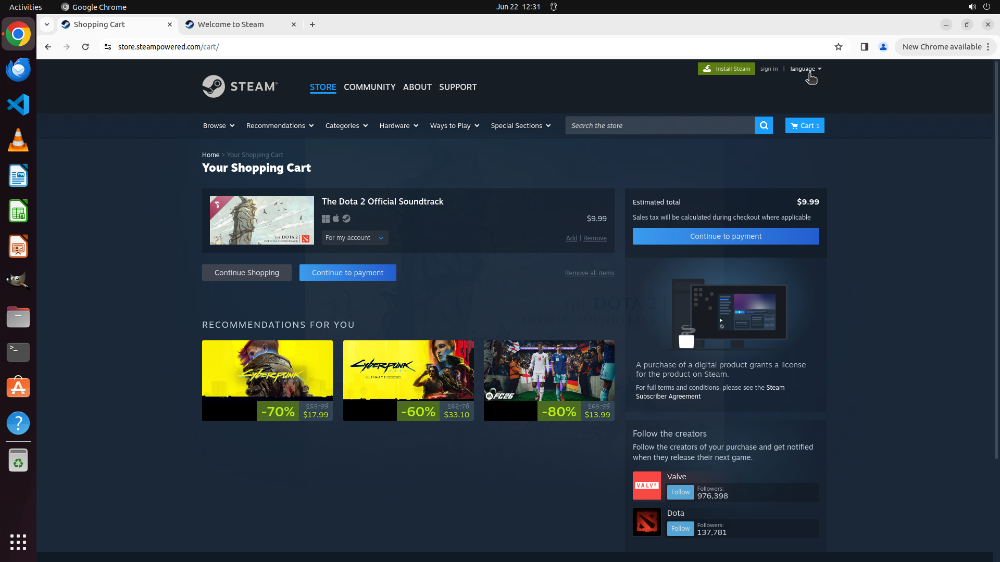

# Find Dota 2 game and add all DLC to cart.

[← Chrome](../README.md) · [← Showcase](../../README.md)

## Task

> Find Dota 2 game and add all DLC to cart.

## Final state

## Artifacts

- [Trajectory](traj.jsonl) — per-step actions, reasoning, and screenshots
- [Runtime log](runtime.log)
- [Task definition](task.json) — original OSWorld task config
- Step screenshots: `step_*.png` in this folder

Task ID: `121ba48f-9e17-48ce-9bc6-a4fb17a7ebba` · Domain: `chrome` · Source: `Mind2Web`
