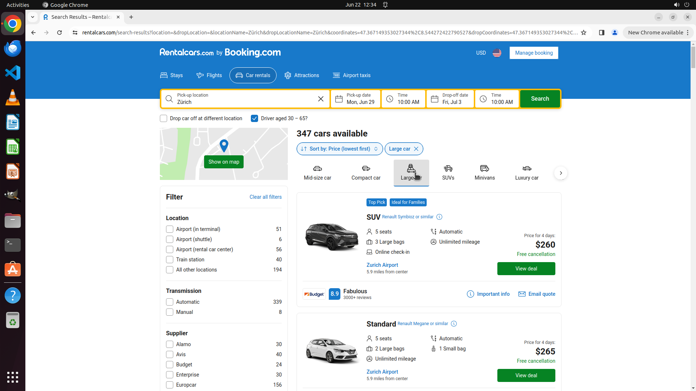

# Find a large car from next Monday to Friday in Zurich, sorted by price.

[← Chrome](../README.md) · [← Showcase](../../README.md)

## Task

> Find a large car from next Monday to Friday in Zurich, sorted by price.

## Final state

## Artifacts

- [Trajectory](traj.jsonl) — per-step actions, reasoning, and screenshots
- [Runtime log](runtime.log)
- [Task definition](task.json) — original OSWorld task config
- Step screenshots: `step_*.png` in this folder

Task ID: `1704f00f-79e6-43a7-961b-cedd3724d5fd` · Domain: `chrome` · Source: `test_task_0`
