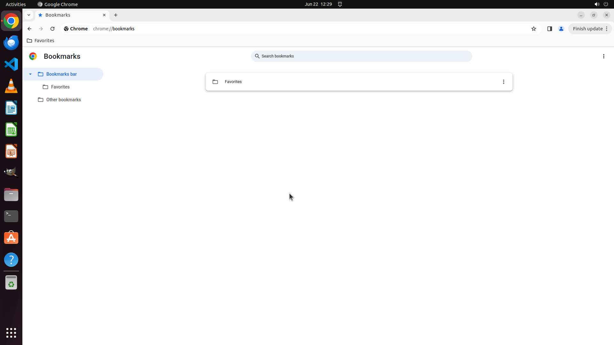

# Can you make a new folder for me on the bookmarks bar in my internet browser? Let's call it 'Favorit…

[← Chrome](../README.md) · [← Showcase](../../README.md)

## Task

> Can you make a new folder for me on the bookmarks bar in my internet browser? Let's call it 'Favorites.'

## Final state

## Artifacts

- [Trajectory](traj.jsonl) — per-step actions, reasoning, and screenshots
- [Runtime log](runtime.log)
- [Task definition](task.json) — original OSWorld task config
- Step screenshots: `step_*.png` in this folder

Task ID: `2ad9387a-65d8-4e33-ad5b-7580065a27ca` · Domain: `chrome` · Source: `https://www.youtube.com/watch?v=IN-Eq_UripQ`
