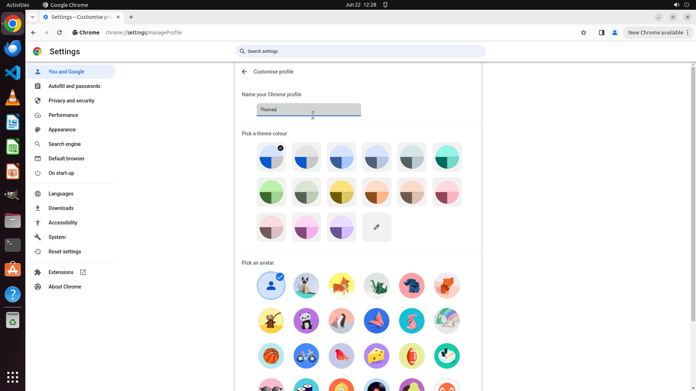

# Lately I have changed my English name to Thomas. I want to update my username. Could you help me cha…

[← Chrome](../README.md) · [← Showcase](../../README.md)

## Task

> Lately I have changed my English name to Thomas. I want to update my username. Could you help me change the username in chrome profiles to Thomas?

## Final state

## Artifacts

- [Trajectory](traj.jsonl) — per-step actions, reasoning, and screenshots
- [Runtime log](runtime.log)
- [Task definition](task.json) — original OSWorld task config
- Step screenshots: `step_*.png` in this folder

Task ID: `2ae9ba84-3a0d-4d4c-8338-3a1478dc5fe3` · Domain: `chrome` · Source: `https://superuser.com/questions/1393683/how-to-change-the-username-in-google-chrome-profiles?rq=1`
