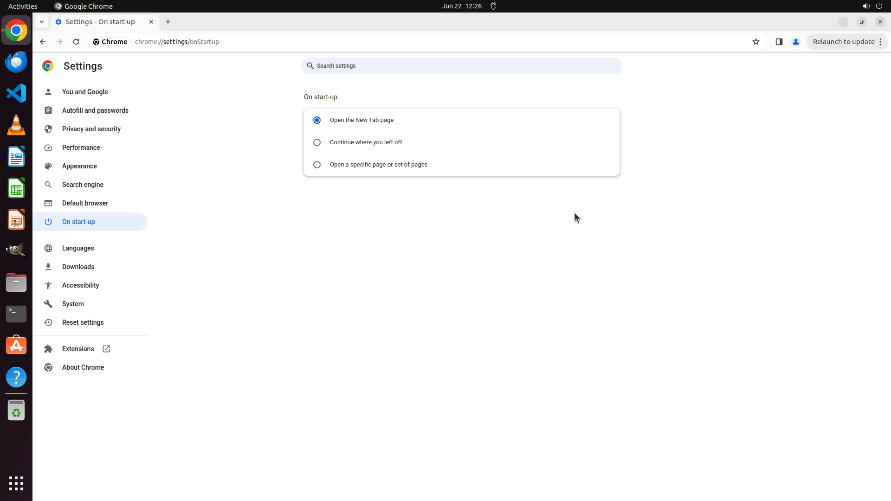

# On my surface pro whenever I launch Chrome it always opens "funbrain.com." I don't want this. I clea…

[← Chrome](../README.md) · [← Showcase](../../README.md)

## Task

> On my surface pro whenever I launch Chrome it always opens "funbrain.com." I don't want this. I cleared my cache but it still happens. What should I do?

## Final state

## Artifacts

- [Trajectory](traj.jsonl) — per-step actions, reasoning, and screenshots
- [Runtime log](runtime.log)
- [Task definition](task.json) — original OSWorld task config
- Step screenshots: `step_*.png` in this folder

Task ID: `3299584d-8f11-4457-bf4c-ce98f7600250` · Domain: `chrome` · Source: `https://www.reddit.com/r/techsupport/comments/12zwymy/comment/jhtri65/?utm_source=share&utm_medium=web2x&context=3`
