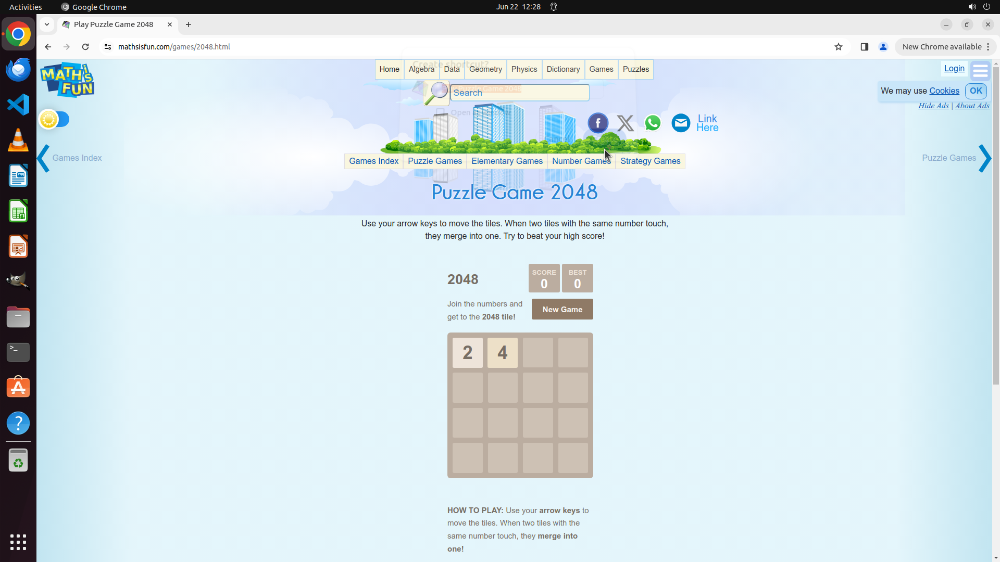

# Hey, I need a quick way back to this site. Could you whip up a shortcut on my desktop for me using C…

[← Chrome](../README.md) · [← Showcase](../../README.md)

## Task

> Hey, I need a quick way back to this site. Could you whip up a shortcut on my desktop for me using Chrome's built-in feature?

## Final state

## Artifacts

- [Trajectory](traj.jsonl) — per-step actions, reasoning, and screenshots
- [Runtime log](runtime.log)
- [Task definition](task.json) — original OSWorld task config
- Step screenshots: `step_*.png` in this folder

Task ID: `35253b65-1c19-4304-8aa4-6884b8218fc0` · Domain: `chrome` · Source: `https://www.laptopmag.com/articles/how-to-create-desktop-shortcuts-for-web-pages-using-chrome`
