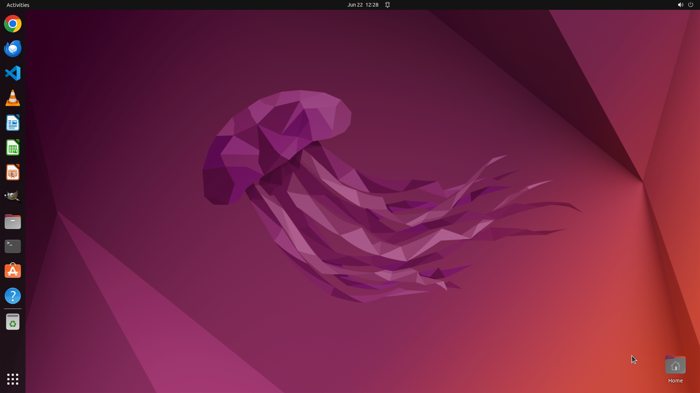

# I am from the country of Atlantis, and my mother tongue is Xenothian. Please change the Google Chrom…

[← Chrome](../README.md) · [← Showcase](../../README.md)

## Task

> I am from the country of Atlantis, and my mother tongue is Xenothian. Please change the Google Chrome interface language to Xenothian using only Chrome’s built-in settings.

## Final state

## Artifacts

- [Trajectory](traj.jsonl) — per-step actions, reasoning, and screenshots
- [Runtime log](runtime.log)
- [Task definition](task.json) — original OSWorld task config
- Step screenshots: `step_*.png` in this folder

Task ID: `3720f614-37fd-4d04-8a6b-76f54f8c222d` · Domain: `chrome` · Source: `https://superuser.com/questions/984668/change-interface-language-of-chrome-to-english`
