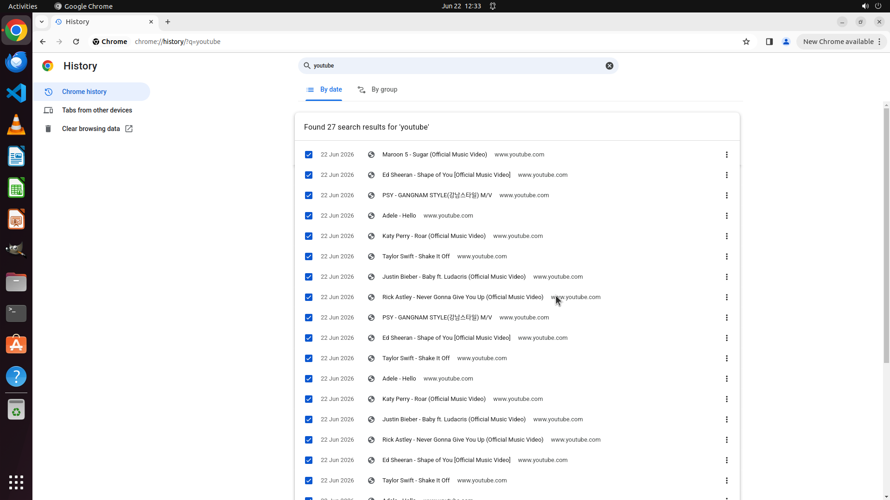

# I am looking for an website address I accessed a month ago, but Youtube websites which take almost a…

[← Chrome](../README.md) · [← Showcase](../../README.md)

## Task

> I am looking for an website address I accessed a month ago, but Youtube websites which take almost all of my browsing history are interrupting my search. This is too annoying. I want to remove all my Youtube browsing history first to facilitate my search. Could you help me clear browsing history from Youtube?

## Final state

## Artifacts

- [Trajectory](traj.jsonl) — per-step actions, reasoning, and screenshots
- [Runtime log](runtime.log)
- [Task definition](task.json) — original OSWorld task config
- Step screenshots: `step_*.png` in this folder

Task ID: `44ee5668-ecd5-4366-a6ce-c1c9b8d4e938` · Domain: `chrome` · Source: `https://superuser.com/questions/1787991/clear-browsing-history-from-specific-site-on-chrome`
