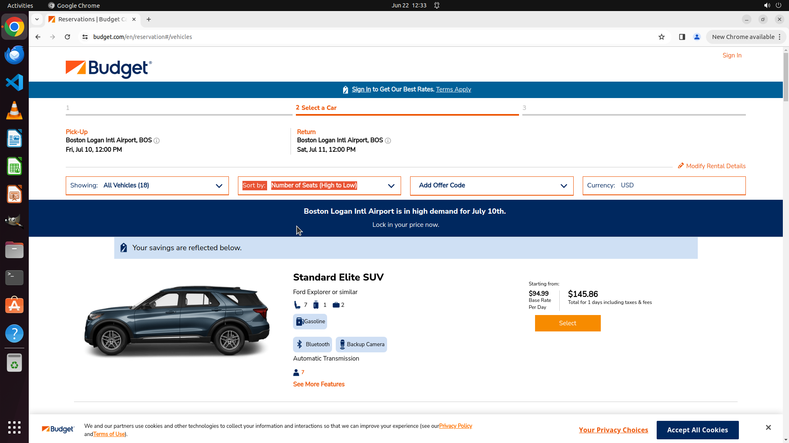

# On the current website, show me the cars available for pickup at Boston Logan Intl Airport from the …

[← Chrome](../README.md) · [← Showcase](../../README.md)

## Task

> On the current website, show me the cars available for pickup at Boston Logan Intl Airport from the 10th to the 11th of next month, sorted by the number of seats to find the largest capacity.

## Final state

## Artifacts

- [Trajectory](traj.jsonl) — per-step actions, reasoning, and screenshots
- [Runtime log](runtime.log)
- [Task definition](task.json) — original OSWorld task config
- Step screenshots: `step_*.png` in this folder

Task ID: `47543840-672a-467d-80df-8f7c3b9788c9` · Domain: `chrome` · Source: `test_task_1`
