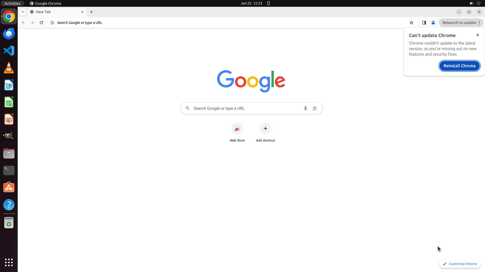

# I do not like the design of the new 2023 chrome UI. I want to keep using the original one. Can you d…

[← Chrome](../README.md) · [← Showcase](../../README.md)

## Task

> I do not like the design of the new 2023 chrome UI. I want to keep using the original one. Can you disable the new 2023 version chrome UI for me?

## Final state

## Artifacts

- [Trajectory](traj.jsonl) — per-step actions, reasoning, and screenshots
- [Runtime log](runtime.log)
- [Task definition](task.json) — original OSWorld task config
- Step screenshots: `step_*.png` in this folder

Task ID: `480bcfea-d68f-4aaa-a0a9-2589ef319381` · Domain: `chrome` · Source: `https://bugartisan.medium.com/disable-the-new-chrome-ui-round-in-2023-db168271f71e`
