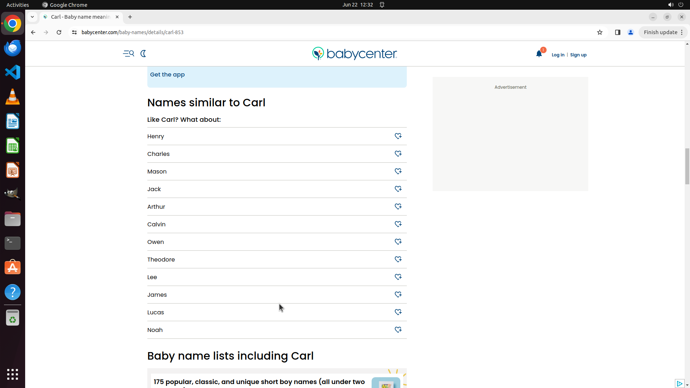

# What are the similar names to the name carl

[← Chrome](../README.md) · [← Showcase](../../README.md)

## Task

> What are the similar names to the name carl

## Final state

## Artifacts

- [Trajectory](traj.jsonl) — per-step actions, reasoning, and screenshots
- [Runtime log](runtime.log)
- [Task definition](task.json) — original OSWorld task config
- Step screenshots: `step_*.png` in this folder

Task ID: `59155008-fe71-45ec-8a8f-dc35497b6aa8` · Domain: `chrome` · Source: `Mind2Web`
