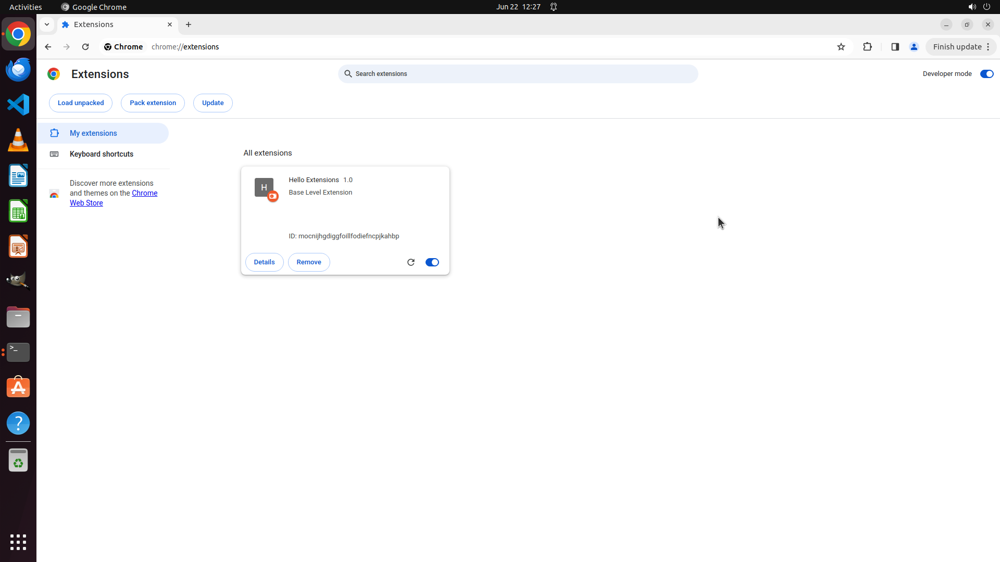

# Could you help me unzip the downloaded extension file from /home/user/Desktop/ to /home/user/Desktop…

[← Chrome](../README.md) · [← Showcase](../../README.md)

## Task

> Could you help me unzip the downloaded extension file from /home/user/Desktop/ to /home/user/Desktop/ and configure it in Chrome's extensions?

## Final state

## Artifacts

- [Trajectory](traj.jsonl) — per-step actions, reasoning, and screenshots
- [Runtime log](runtime.log)
- [Task definition](task.json) — original OSWorld task config
- Step screenshots: `step_*.png` in this folder

Task ID: `6766f2b8-8a72-417f-a9e5-56fcaa735837` · Domain: `chrome` · Source: `https://support.google.com/chrome/thread/205881926/it-s-possible-to-load-unpacked-extension-automatically-in-chrome?hl=en`
