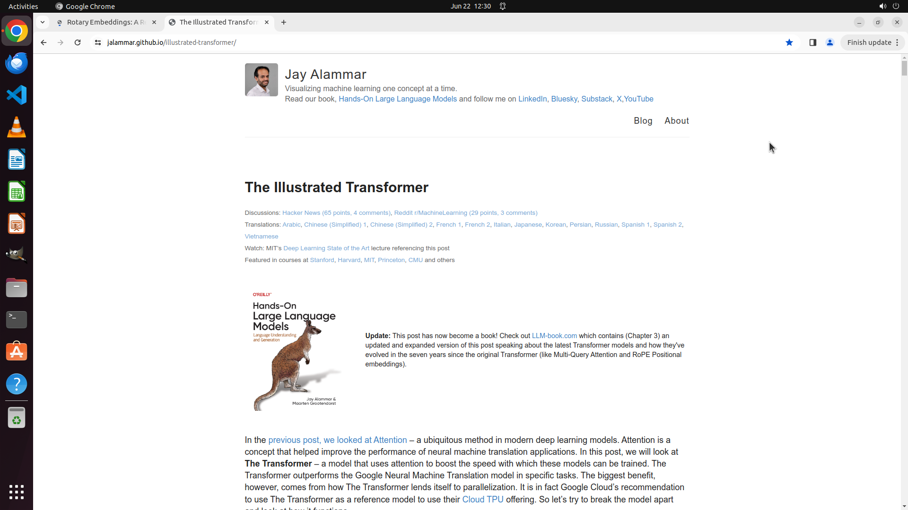

# Can you save this webpage I'm looking at to bookmarks bar so I can come back to it later?

[← Chrome](../README.md) · [← Showcase](../../README.md)

## Task

> Can you save this webpage I'm looking at to bookmarks bar so I can come back to it later?

## Final state

## Artifacts

- [Trajectory](traj.jsonl) — per-step actions, reasoning, and screenshots
- [Runtime log](runtime.log)
- [Task definition](task.json) — original OSWorld task config
- Step screenshots: `step_*.png` in this folder

Task ID: `7a5a7856-f1b6-42a4-ade9-1ca81ca0f263` · Domain: `chrome` · Source: `https://www.youtube.com/watch?v=ZaZ8GcTxjXA`
