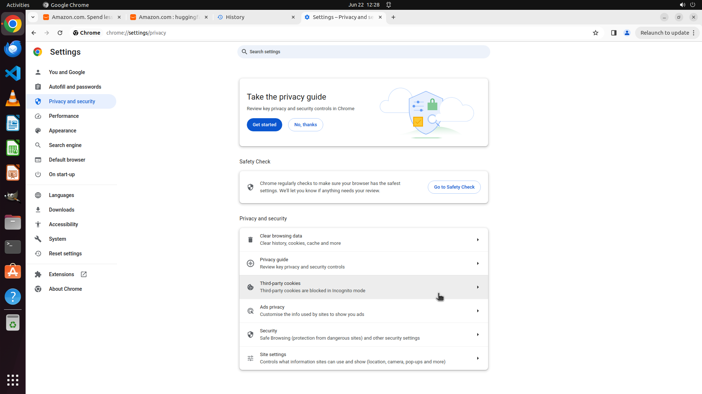

# Can you help me clean up my computer by getting rid of all the tracking things that Amazon might hav…

[← Chrome](../README.md) · [← Showcase](../../README.md)

## Task

> Can you help me clean up my computer by getting rid of all the tracking things that Amazon might have saved? I want to make sure my browsing is private and those sites don't remember me.

## Final state

## Artifacts

- [Trajectory](traj.jsonl) — per-step actions, reasoning, and screenshots
- [Runtime log](runtime.log)
- [Task definition](task.json) — original OSWorld task config
- Step screenshots: `step_*.png` in this folder

Task ID: `7b6c7e24-c58a-49fc-a5bb-d57b80e5b4c3` · Domain: `chrome` · Source: `https://support.google.com/chrome/answer/95647?hl=en&ref_topic=7438325&sjid=16867045591165135686-AP#zippy=%2Cdelete-cookies-from-a-site`
