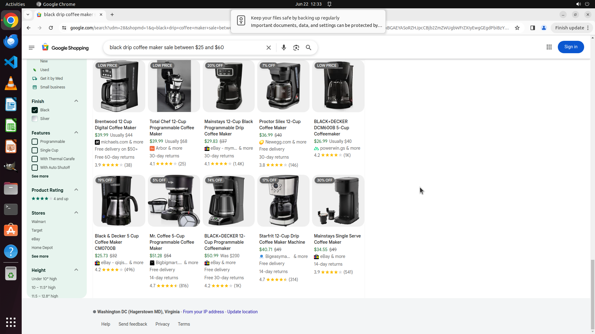

# Create a list of drip coffee makers that are on sale and within $25-60 and have a black finish.

[← Chrome](../README.md) · [← Showcase](../../README.md)

## Task

> Create a list of drip coffee makers that are on sale and within $25-60 and have a black finish.

## Final state

## Artifacts

- [Trajectory](traj.jsonl) — per-step actions, reasoning, and screenshots
- [Runtime log](runtime.log)
- [Task definition](task.json) — original OSWorld task config
- Step screenshots: `step_*.png` in this folder

Task ID: `7f52cab9-535c-4835-ac8c-391ee64dc930` · Domain: `chrome` · Source: `test_task_1`
