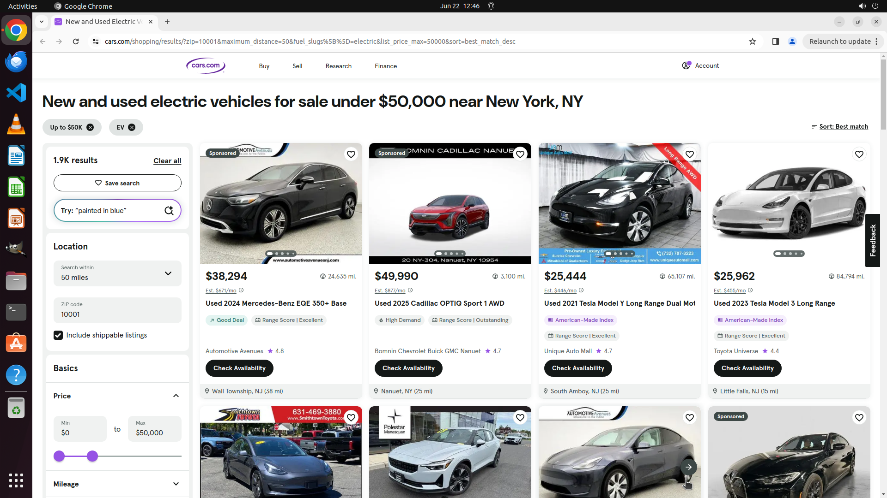

# Find electric cars with a maximum price of $50,000 within 50 miles of 10001.

[← Chrome](../README.md) · [← Showcase](../../README.md)

## Task

> Find electric cars with a maximum price of $50,000 within 50 miles of 10001.

## Final state

## Artifacts

- [Trajectory](traj.jsonl) — per-step actions, reasoning, and screenshots
- [Runtime log](runtime.log)
- [Task definition](task.json) — original OSWorld task config
- Step screenshots: `step_*.png` in this folder

Task ID: `82279c77-8fc6-46f6-9622-3ba96f61b477` · Domain: `chrome` · Source: `test_task_1`
