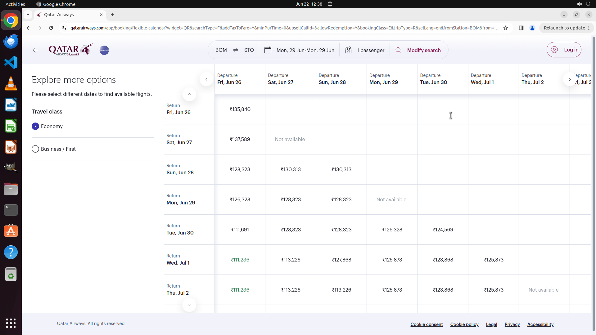

# On next Monday, look up a flight from Mumbai to Stockholm.

[← Chrome](../README.md) · [← Showcase](../../README.md)

## Task

> On next Monday, look up a flight from Mumbai to Stockholm.

## Final state

## Artifacts

- [Trajectory](traj.jsonl) — per-step actions, reasoning, and screenshots
- [Runtime log](runtime.log)
- [Task definition](task.json) — original OSWorld task config
- Step screenshots: `step_*.png` in this folder

Task ID: `82bc8d6a-36eb-4d2d-8801-ef714fb1e55a` · Domain: `chrome` · Source: `test_task_1`
