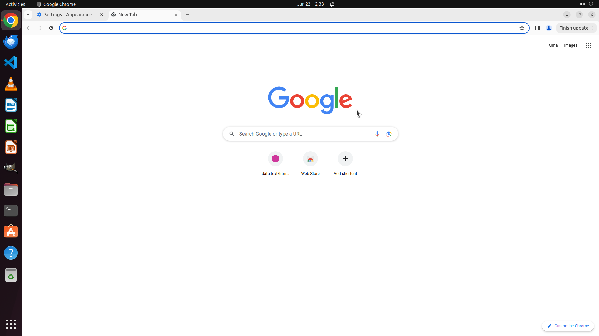

# Could you assist me in turning off the dark mode feature in Google Chrome? I've noticed that while d…

[← Chrome](../README.md) · [← Showcase](../../README.md)

## Task

> Could you assist me in turning off the dark mode feature in Google Chrome? I've noticed that while dark mode is great for reducing glare, it actually makes it more challenging for me to read text clearly, especially with my astigmatism.

## Final state

## Artifacts

- [Trajectory](traj.jsonl) — per-step actions, reasoning, and screenshots
- [Runtime log](runtime.log)
- [Task definition](task.json) — original OSWorld task config
- Step screenshots: `step_*.png` in this folder

Task ID: `93eabf48-6a27-4cb6-b963-7d5fe1e0d3a9` · Domain: `chrome` · Source: `https://superuser.com/questions/1417973/how-to-disable-google-chrome-dark-mode`
