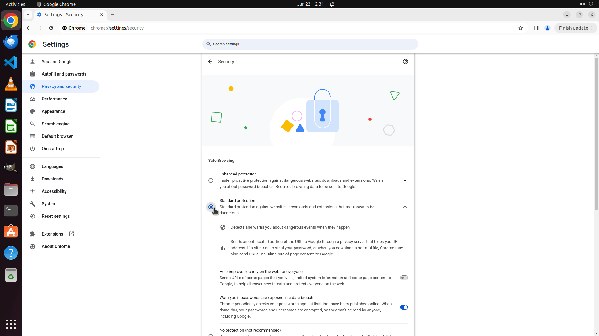

# I want Chrome to warn me whenever I visit a potentially harmful or unsafe website. Can you enable th…

[← Chrome](../README.md) · [← Showcase](../../README.md)

## Task

> I want Chrome to warn me whenever I visit a potentially harmful or unsafe website. Can you enable this safety feature?

## Final state

## Artifacts

- [Trajectory](traj.jsonl) — per-step actions, reasoning, and screenshots
- [Runtime log](runtime.log)
- [Task definition](task.json) — original OSWorld task config
- Step screenshots: `step_*.png` in this folder

Task ID: `9656a811-9b5b-4ddf-99c7-5117bcef0626` · Domain: `chrome` · Source: `https://www.quora.com/How-do-I-set-the-security-settings-for-the-Google-Chrome-browser-for-the-best-security#:~:text=Enable%20Safe%20Browsing:%20Chrome%20has%20a%20built%2Din,Security%20%3E%20Security%20%3E%20Enable%20Safe%20Browsing.`
