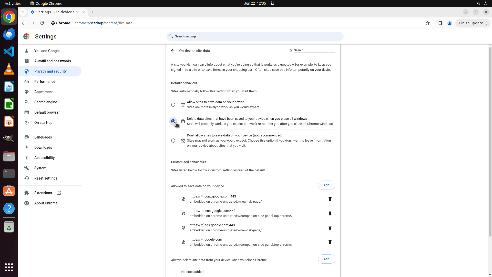

# Please help me set Chrome to delete my browsing data automatically every time I close the browser.

[← Chrome](../README.md) · [← Showcase](../../README.md)

## Task

> Please help me set Chrome to delete my browsing data automatically every time I close the browser.

## Final state

## Artifacts

- [Trajectory](traj.jsonl) — per-step actions, reasoning, and screenshots
- [Runtime log](runtime.log)
- [Task definition](task.json) — original OSWorld task config
- Step screenshots: `step_*.png` in this folder

Task ID: `99146c54-4f37-4ab8-9327-5f3291665e1e` · Domain: `chrome` · Source: `https://www.youtube.com/watch?v=v0kxqB7Xa6I`
