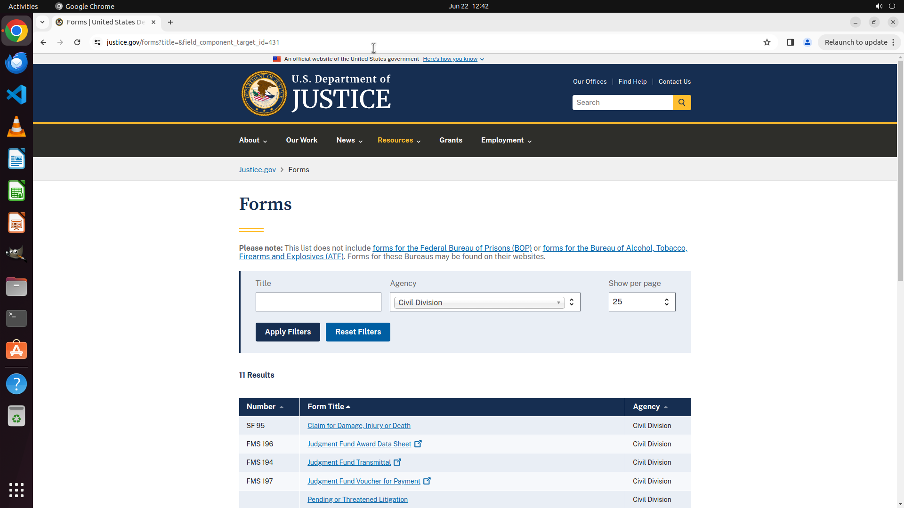

# Browse list of Civil Division forms.

[← Chrome](../README.md) · [← Showcase](../../README.md)

## Task

> Browse list of Civil Division forms.

## Final state

## Artifacts

- [Trajectory](traj.jsonl) — per-step actions, reasoning, and screenshots
- [Runtime log](runtime.log)
- [Task definition](task.json) — original OSWorld task config
- Step screenshots: `step_*.png` in this folder

Task ID: `9f935cce-0a9f-435f-8007-817732bfc0a5` · Domain: `chrome` · Source: `online_tasks`
