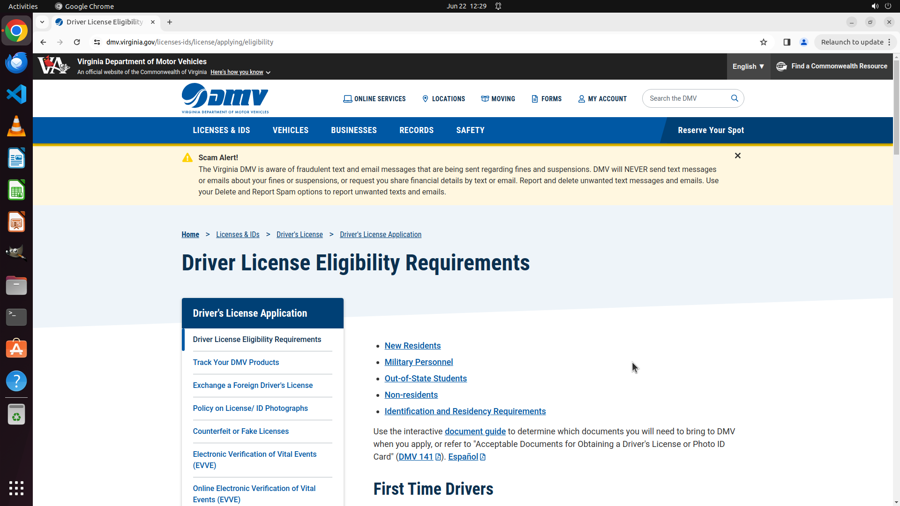

# Find the Driver License Eligibility Requirements

[← Chrome](../README.md) · [← Showcase](../../README.md)

## Task

> Find the Driver License Eligibility Requirements

## Final state

## Artifacts

- [Trajectory](traj.jsonl) — per-step actions, reasoning, and screenshots
- [Runtime log](runtime.log)
- [Task definition](task.json) — original OSWorld task config
- Step screenshots: `step_*.png` in this folder

Task ID: `a728a36e-8bf1-4bb6-9a03-ef039a5233f0` · Domain: `chrome` · Source: `Mind2Web`
