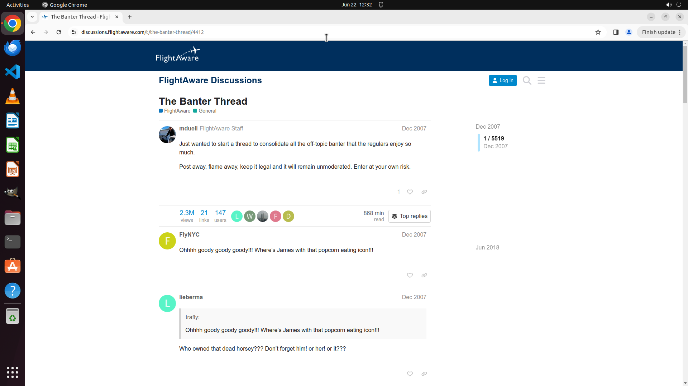

# Find discussions of community and open one with most replies.

[← Chrome](../README.md) · [← Showcase](../../README.md)

## Task

> Find discussions of community and open one with most replies.

## Final state

## Artifacts

- [Trajectory](traj.jsonl) — per-step actions, reasoning, and screenshots
- [Runtime log](runtime.log)
- [Task definition](task.json) — original OSWorld task config
- Step screenshots: `step_*.png` in this folder

Task ID: `a96b564e-dbe9-42c3-9ccf-b4498073438a` · Domain: `chrome` · Source: `test_task_0`
