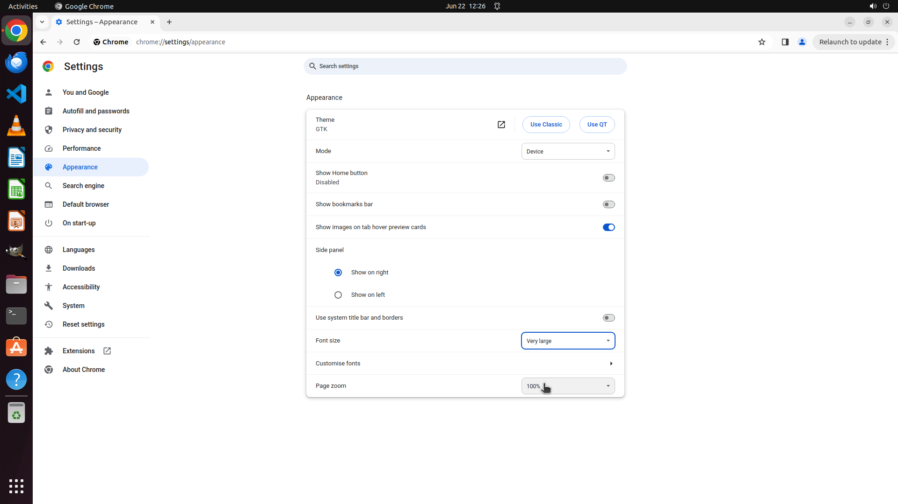

# My grandmother has been using the Chrome lately and told me that the font size is way too small for …

[← Chrome](../README.md) · [← Showcase](../../README.md)

## Task

> My grandmother has been using the Chrome lately and told me that the font size is way too small for her poor eyesight. Could you set the default font size to the largest for her?

## Final state

## Artifacts

- [Trajectory](traj.jsonl) — per-step actions, reasoning, and screenshots
- [Runtime log](runtime.log)
- [Task definition](task.json) — original OSWorld task config
- Step screenshots: `step_*.png` in this folder

Task ID: `af630914-714e-4a24-a7bb-f9af687d3b91` · Domain: `chrome` · Source: `https://www.howtogeek.com/680260/how-to-change-chromes-default-text-size/`
