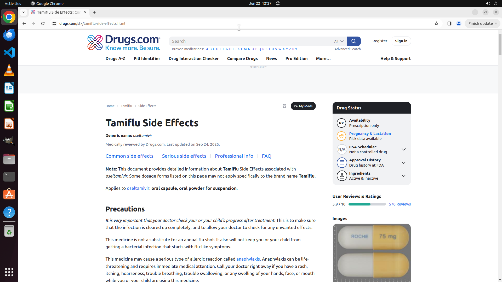

# Show side effects of Tamiflu.

[← Chrome](../README.md) · [← Showcase](../../README.md)

## Task

> Show side effects of Tamiflu.

## Final state

## Artifacts

- [Trajectory](traj.jsonl) — per-step actions, reasoning, and screenshots
- [Runtime log](runtime.log)
- [Task definition](task.json) — original OSWorld task config
- Step screenshots: `step_*.png` in this folder

Task ID: `b070486d-e161-459b-aa2b-ef442d973b92` · Domain: `chrome` · Source: `online_tasks`
