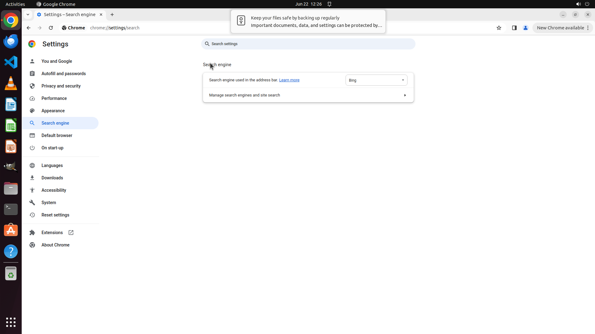

# Can you make Bing the main search engine when I look stuff up on the internet?

[← Chrome](../README.md) · [← Showcase](../../README.md)

## Task

> Can you make Bing the main search engine when I look stuff up on the internet?

## Final state

## Artifacts

- [Trajectory](traj.jsonl) — per-step actions, reasoning, and screenshots
- [Runtime log](runtime.log)
- [Task definition](task.json) — original OSWorld task config
- Step screenshots: `step_*.png` in this folder

Task ID: `bb5e4c0d-f964-439c-97b6-bdb9747de3f4` · Domain: `chrome` · Source: `https://support.google.com/chrome/answer/95426?sjid=16867045591165135686-AP`
