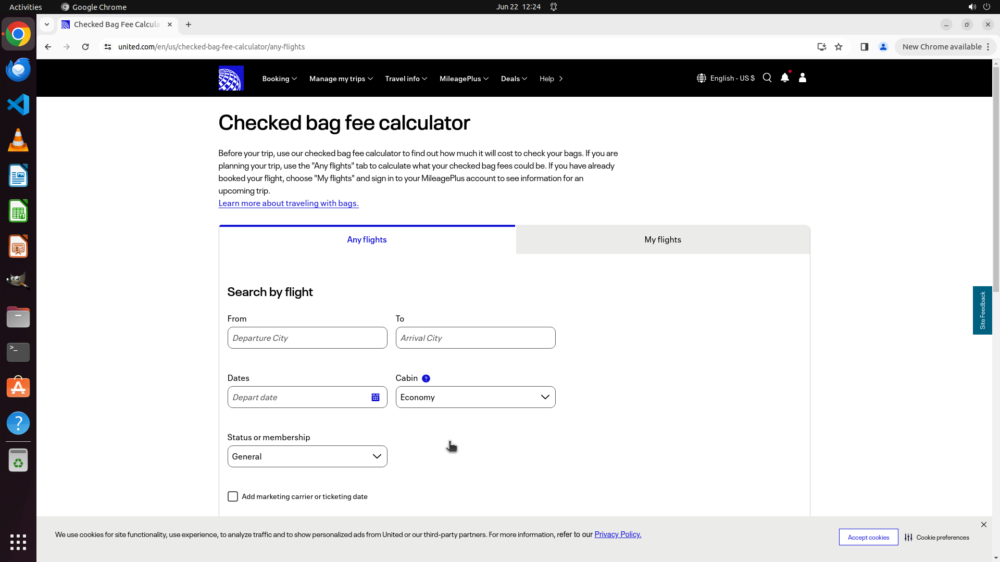

# Open the baggage fee calculator in United Airlines website.

[← Chrome](../README.md) · [← Showcase](../../README.md)

## Task

> Open the baggage fee calculator in United Airlines website.

## Final state

## Artifacts

- [Trajectory](traj.jsonl) — per-step actions, reasoning, and screenshots
- [Runtime log](runtime.log)
- [Task definition](task.json) — original OSWorld task config
- Step screenshots: `step_*.png` in this folder

Task ID: `c1fa57f3-c3db-4596-8f09-020701085416` · Domain: `chrome` · Source: `test_task_1`
