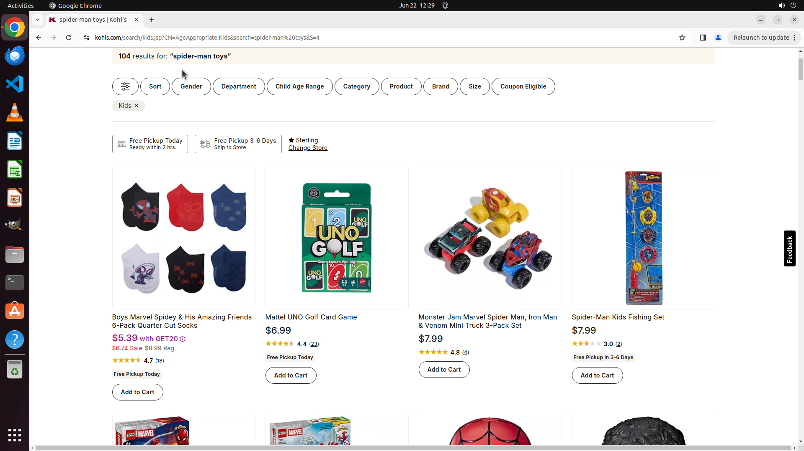

# Browse spider-man toys for kids and sort by lowest price.

[← Chrome](../README.md) · [← Showcase](../../README.md)

## Task

> Browse spider-man toys for kids and sort by lowest price.

## Final state

## Artifacts

- [Trajectory](traj.jsonl) — per-step actions, reasoning, and screenshots
- [Runtime log](runtime.log)
- [Task definition](task.json) — original OSWorld task config
- Step screenshots: `step_*.png` in this folder

Task ID: `cabb3bae-cccb-41bd-9f5d-0f3a9fecd825` · Domain: `chrome` · Source: `online_tasks`
