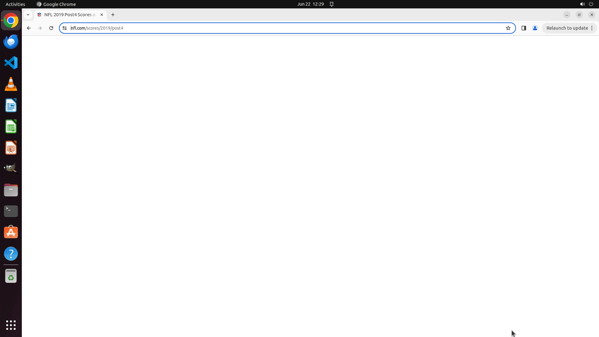

# Please help me find the score record for the Super Bowl of the 2019 NFL season (played in 2020) in t…

[← Chrome](../README.md) · [← Showcase](../../README.md)

## Task

> Please help me find the score record for the Super Bowl of the 2019 NFL season (played in 2020) in the NFL website.

## Final state

## Artifacts

- [Trajectory](traj.jsonl) — per-step actions, reasoning, and screenshots
- [Runtime log](runtime.log)
- [Task definition](task.json) — original OSWorld task config
- Step screenshots: `step_*.png` in this folder

Task ID: `f0b971a1-6831-4b9b-a50e-22a6e47f45ba` · Domain: `chrome` · Source: `Mind2Web`
