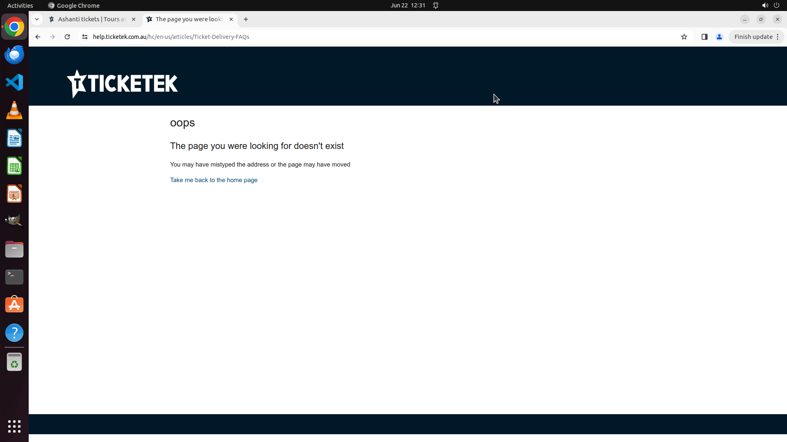

# Find the FAQ page about ticket delivery.

[← Chrome](../README.md) · [← Showcase](../../README.md)

## Task

> Find the FAQ page about ticket delivery.

## Final state

## Artifacts

- [Trajectory](traj.jsonl) — per-step actions, reasoning, and screenshots
- [Runtime log](runtime.log)
- [Task definition](task.json) — original OSWorld task config
- Step screenshots: `step_*.png` in this folder

Task ID: `f3b19d1e-2d48-44e9-b4e1-defcae1a0197` · Domain: `chrome` · Source: `test_task_0`
