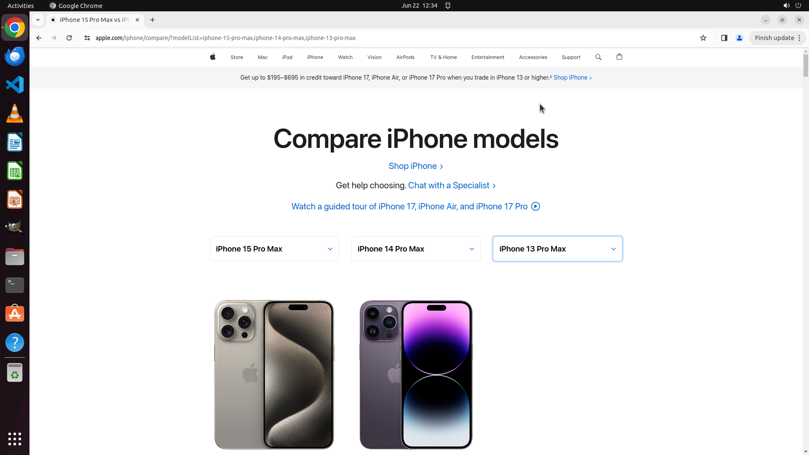

# Compare iPhone 15 Pro Max with iPhone 14 Pro Max and iPhone 13 Pro Max

[← Chrome](../README.md) · [← Showcase](../../README.md)

## Task

> Compare iPhone 15 Pro Max with iPhone 14 Pro Max and iPhone 13 Pro Max

## Final state

## Artifacts

- [Trajectory](traj.jsonl) — per-step actions, reasoning, and screenshots
- [Runtime log](runtime.log)
- [Task definition](task.json) — original OSWorld task config
- Step screenshots: `step_*.png` in this folder

Task ID: `f5d96daf-83a8-4c86-9686-bada31fc66ab` · Domain: `chrome` · Source: `Mind2Web`
