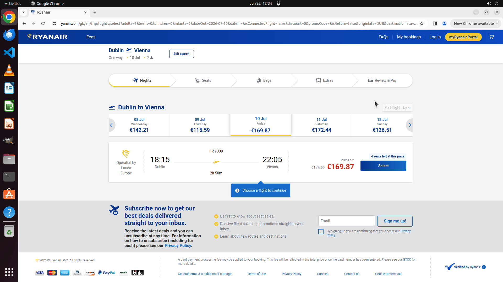

# Search for a one way flight from Dublin to Vienna on 10th next month for 2 adults.

[← Chrome](../README.md) · [← Showcase](../../README.md)

## Task

> Search for a one way flight from Dublin to Vienna on 10th next month for 2 adults.

## Final state

## Artifacts

- [Trajectory](traj.jsonl) — per-step actions, reasoning, and screenshots
- [Runtime log](runtime.log)
- [Task definition](task.json) — original OSWorld task config
- Step screenshots: `step_*.png` in this folder

Task ID: `f79439ad-3ee8-4f99-a518-0eb60e5652b0` · Domain: `chrome` · Source: `test_task_2`
