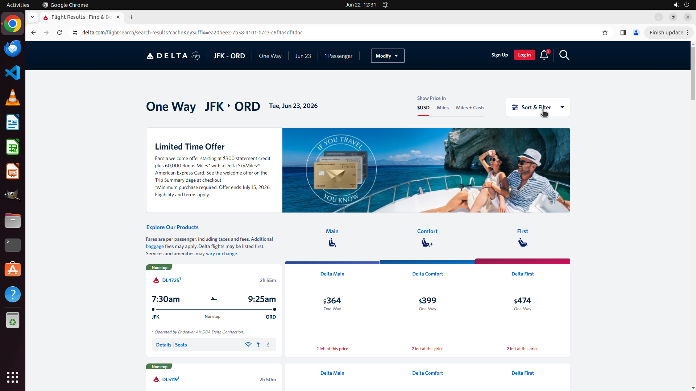

# Find flights from New York–Kennedy Airport to Chicago O'Hare Airport for tomorrow.

[← Chrome](../README.md) · [← Showcase](../../README.md)

## Task

> Find flights from New York–Kennedy Airport to Chicago O'Hare Airport for tomorrow.

## Final state

## Artifacts

- [Trajectory](traj.jsonl) — per-step actions, reasoning, and screenshots
- [Runtime log](runtime.log)
- [Task definition](task.json) — original OSWorld task config
- Step screenshots: `step_*.png` in this folder

Task ID: `fc6d8143-9452-4171-9459-7f515143419a` · Domain: `chrome` · Source: `test_task_0`
