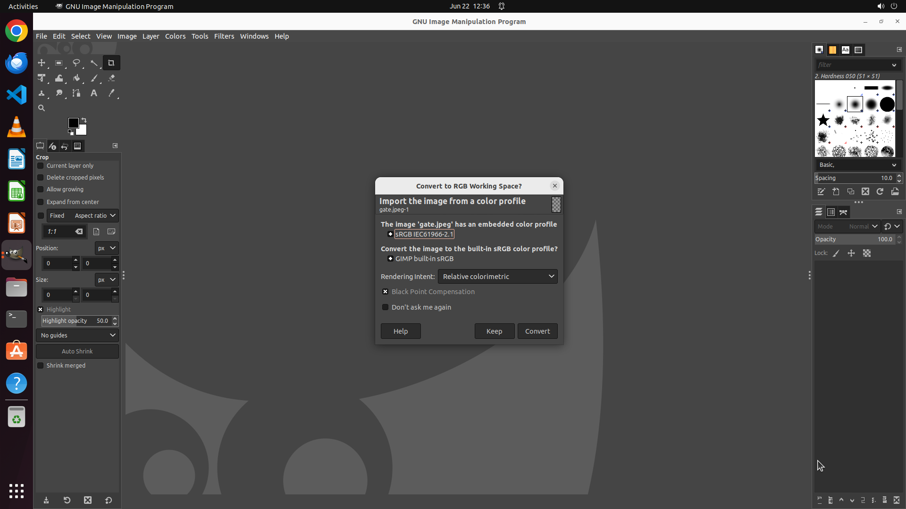

# Could you turn my image into CYMK mode within GIMP ?

[← GIMP](../README.md) · [← Showcase](../../README.md)

## Task

> Could you turn my image into CYMK mode within GIMP ?

## Final state

## Artifacts

- [Trajectory](traj.jsonl) — per-step actions, reasoning, and screenshots
- [Runtime log](runtime.log)
- [Task definition](task.json) — original OSWorld task config
- Step screenshots: `step_*.png` in this folder

Task ID: `045bf3ff-9077-4b86-b483-a1040a949cff` · Domain: `gimp` · Source: `https://www.makeuseof.com/tag/can-photoshop-gimp-cant/`
