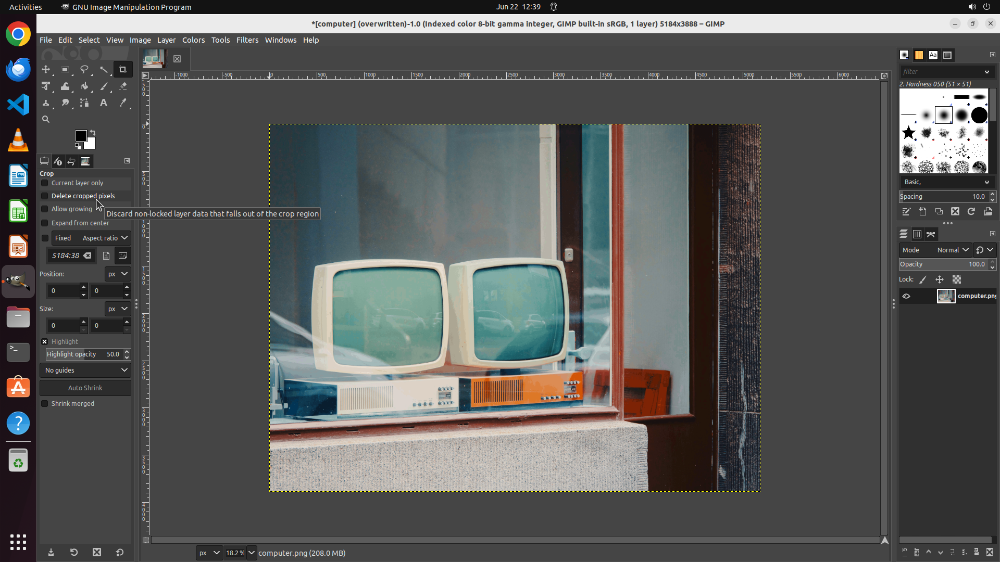

# Could you help me set the image to Palette-Based?

[← GIMP](../README.md) · [← Showcase](../../README.md)

## Task

> Could you help me set the image to Palette-Based?

## Final state

## Artifacts

- [Trajectory](traj.jsonl) — per-step actions, reasoning, and screenshots
- [Runtime log](runtime.log)
- [Task definition](task.json) — original OSWorld task config
- Step screenshots: `step_*.png` in this folder

Task ID: `06ca5602-62ca-47f6-ad4f-da151cde54cc` · Domain: `gimp` · Source: `https://stackoverflow.com/questions/74664666/how-to-export-palette-based-png-in-gimp`
