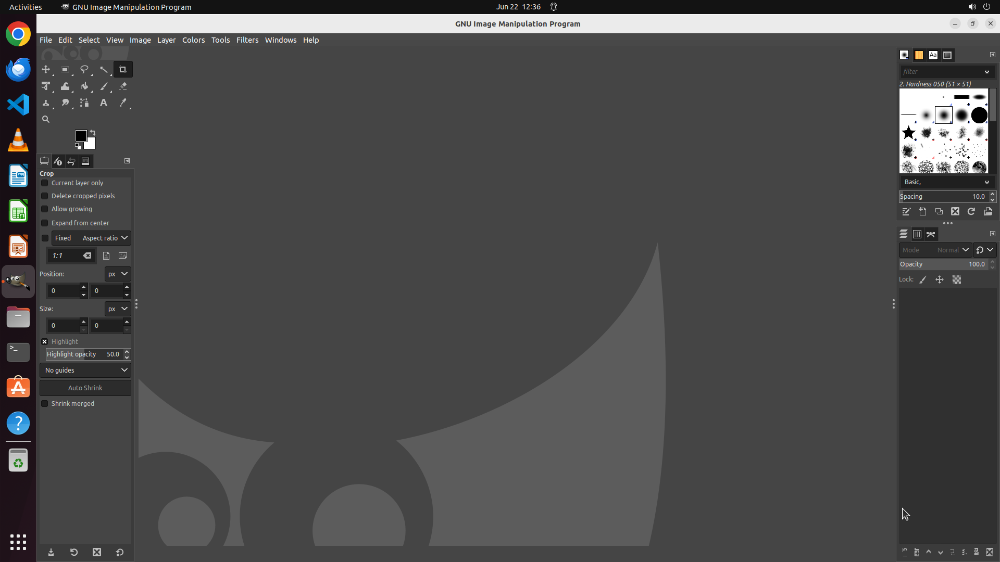

# Please batch process all images on the desktop by increasing their brightness to 50, instead of adju…

[← GIMP](../README.md) · [← Showcase](../../README.md)

## Task

> Please batch process all images on the desktop by increasing their brightness to 50, instead of adjusting them individually within GIMP.

## Final state

## Artifacts

- [Trajectory](traj.jsonl) — per-step actions, reasoning, and screenshots
- [Runtime log](runtime.log)
- [Task definition](task.json) — original OSWorld task config
- Step screenshots: `step_*.png` in this folder

Task ID: `2e6f678f-472d-4c55-99cc-8e7c5c402a71` · Domain: `gimp`
