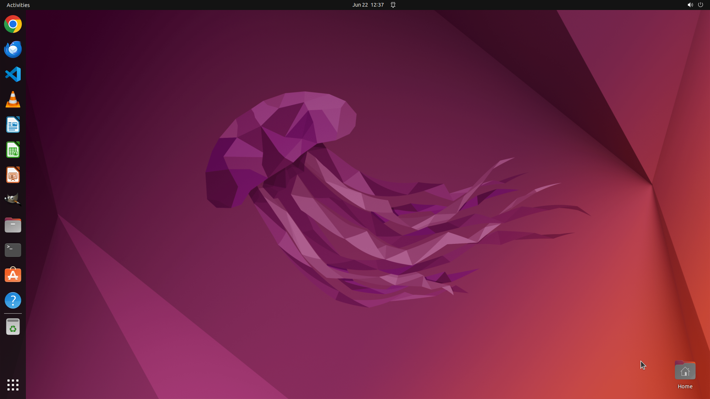

# Could you help me trim the video located at "/home/user/fullvideo.mp4" within GIMP, since I only wan…

[← GIMP](../README.md) · [← Showcase](../../README.md)

## Task

> Could you help me trim the video located at "/home/user/fullvideo.mp4" within GIMP, since I only want the second to fourth second part of this video?

## Final state

## Artifacts

- [Trajectory](traj.jsonl) — per-step actions, reasoning, and screenshots
- [Runtime log](runtime.log)
- [Task definition](task.json) — original OSWorld task config
- Step screenshots: `step_*.png` in this folder

Task ID: `38f48d40-764e-4e77-a7cf-51dfce880291` · Domain: `gimp`
