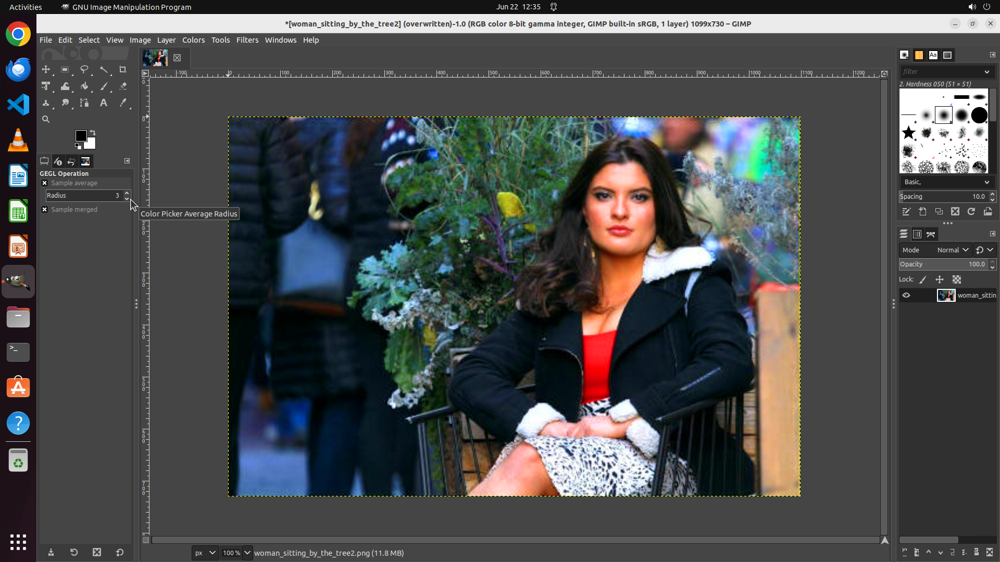

# Could you assist me in enhancing the color vibrancy of my photo?

[← GIMP](../README.md) · [← Showcase](../../README.md)

## Task

> Could you assist me in enhancing the color vibrancy of my photo?

## Final state

## Artifacts

- [Trajectory](traj.jsonl) — per-step actions, reasoning, and screenshots
- [Runtime log](runtime.log)
- [Task definition](task.json) — original OSWorld task config
- Step screenshots: `step_*.png` in this folder

Task ID: `554785e9-4523-4e7a-b8e1-8016f565f56a` · Domain: `gimp` · Source: `https://www.quora.com/How-do-I-edit-a-photo-in-GIMP`
