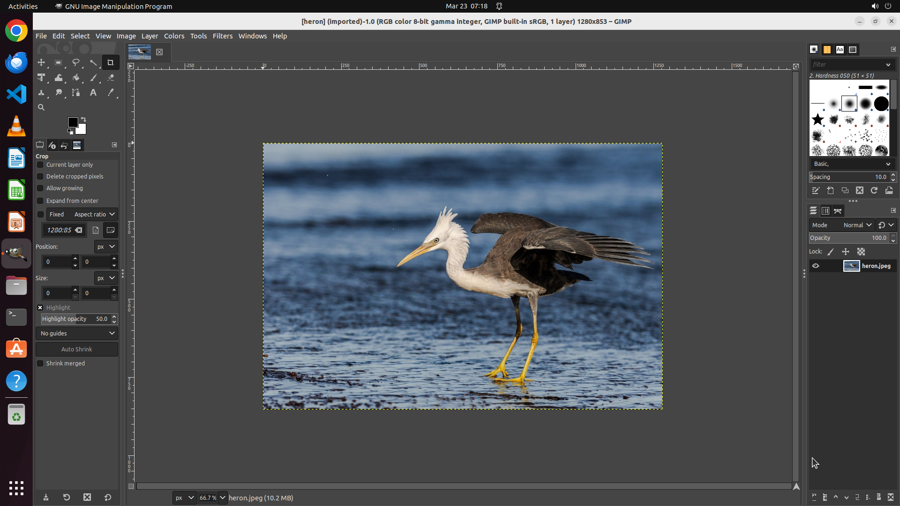

# Based on the image above, translate the hidden audio conversation into French.

[← GIMP](../README.md) · [← Showcase](../../README.md)

## Task

> Based on the image above, translate the hidden audio conversation into French.

## Final state

## Artifacts

- [▶ Screen recording](recording.mp4) — full agent run
- [Trajectory](traj.jsonl) — per-step actions, reasoning, and screenshots
- [Runtime log](runtime.log)
- [Task definition](task.json) — original OSWorld task config
- Step screenshots: `step_*.png` in this folder

Task ID: `58d3eeeb-e9d0-499f-962e-fd0db2a744d8` · Domain: `gimp`
