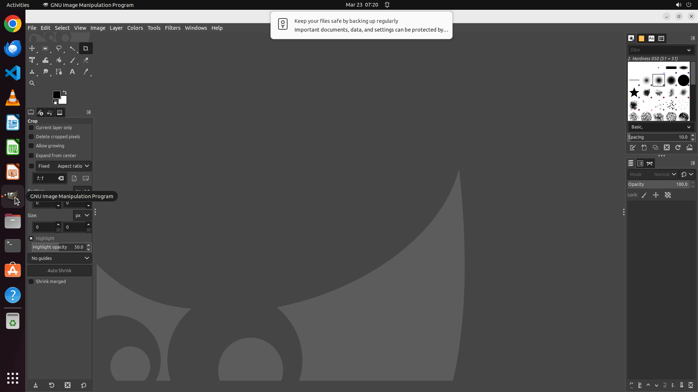

# Could you help me download the logo of the University of Hong Kong in '.png' format using only GIMP'…

[← GIMP](../README.md) · [← Showcase](../../README.md)

## Task

> Could you help me download the logo of the University of Hong Kong in '.png' format using only GIMP's built-in features, without launching a separate web browser?

## Final state

## Artifacts

- [▶ Screen recording](recording.mp4) — full agent run
- [Trajectory](traj.jsonl) — per-step actions, reasoning, and screenshots
- [Runtime log](runtime.log)
- [Task definition](task.json) — original OSWorld task config
- Step screenshots: `step_*.png` in this folder

Task ID: `5ca86c6f-f317-49d8-b6a7-b527541caae8` · Domain: `gimp`
