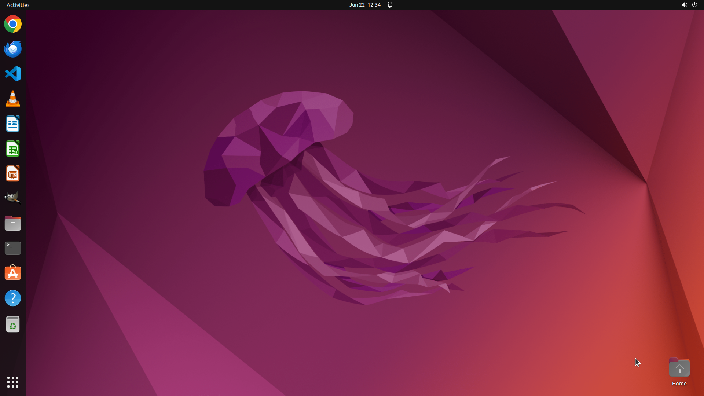

# Could you help me convert the image located at "/home/user/logo.png" to ".svg" format by GIMP?

[← GIMP](../README.md) · [← Showcase](../../README.md)

## Task

> Could you help me convert the image located at "/home/user/logo.png" to ".svg" format by GIMP?

## Final state

## Artifacts

- [Trajectory](traj.jsonl) — per-step actions, reasoning, and screenshots
- [Runtime log](runtime.log)
- [Task definition](task.json) — original OSWorld task config
- Step screenshots: `step_*.png` in this folder

Task ID: `62f7fd55-0687-4a43-b6e1-3eda16fc6252` · Domain: `gimp`
