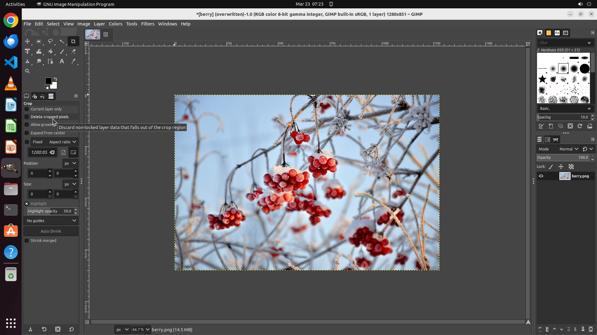

# Please rotate my figure to mirror it horizontally.

[← GIMP](../README.md) · [← Showcase](../../README.md)

## Task

> Please rotate my figure to mirror it horizontally.

## Final state

## Artifacts

- [▶ Screen recording](recording.mp4) — full agent run
- [Trajectory](traj.jsonl) — per-step actions, reasoning, and screenshots
- [Runtime log](runtime.log)
- [Task definition](task.json) — original OSWorld task config
- Step screenshots: `step_*.png` in this folder

Task ID: `72f83cdc-bf76-4531-9a1b-eb893a13f8aa` · Domain: `gimp` · Source: `https://www.youtube.com/watch?v=V3slJcft6Tw`
