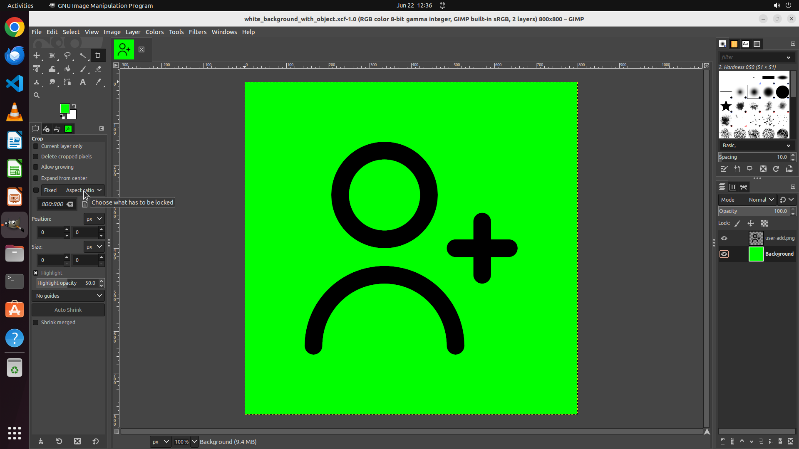

# Could you fill the background layer with green color, leaving the object layer as is?

[← GIMP](../README.md) · [← Showcase](../../README.md)

## Task

> Could you fill the background layer with green color, leaving the object layer as is?

## Final state

## Artifacts

- [Trajectory](traj.jsonl) — per-step actions, reasoning, and screenshots
- [Runtime log](runtime.log)
- [Task definition](task.json) — original OSWorld task config
- Step screenshots: `step_*.png` in this folder

Task ID: `734d6579-c07d-47a8-9ae2-13339795476b` · Domain: `gimp` · Source: `https://www.youtube.com/watch?v=LX-S1CX1HUI`
