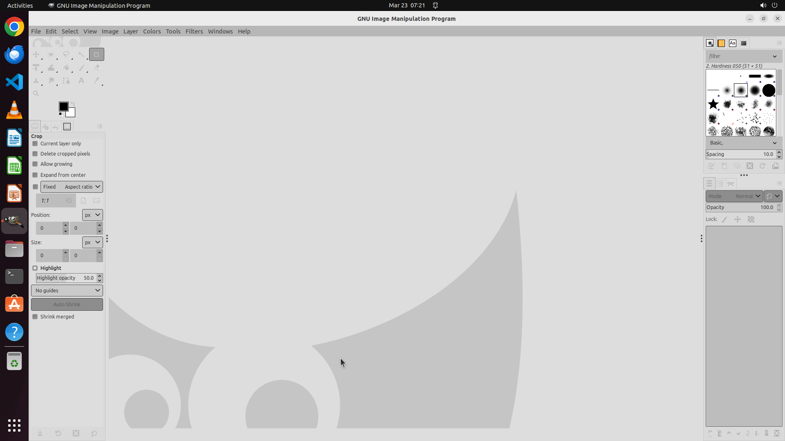

# Please help change GIMP's theme from dark to light.

[← GIMP](../README.md) · [← Showcase](../../README.md)

## Task

> Please help change GIMP's theme from dark to light.

## Final state

## Artifacts

- [▶ Screen recording](recording.mp4) — full agent run
- [Trajectory](traj.jsonl) — per-step actions, reasoning, and screenshots
- [Runtime log](runtime.log)
- [Task definition](task.json) — original OSWorld task config
- Step screenshots: `step_*.png` in this folder

Task ID: `7767eef2-56a3-4cea-8c9f-48c070c7d65b` · Domain: `gimp` · Source: `https://www.youtube.com/watch?v=LX-S1CX1HUI`
