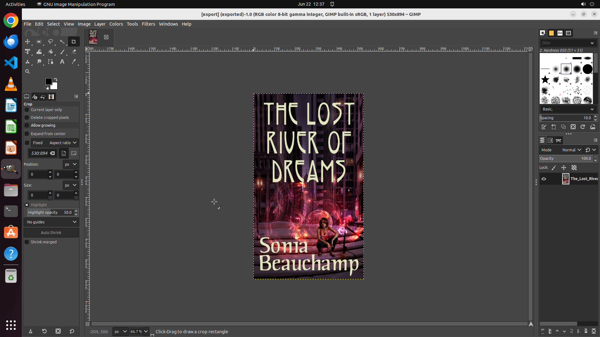

# Could you assist me in placing my photo on the desktop and renaming it to export.jpg?

[← GIMP](../README.md) · [← Showcase](../../README.md)

## Task

> Could you assist me in placing my photo on the desktop and renaming it to export.jpg?

## Final state

## Artifacts

- [Trajectory](traj.jsonl) — per-step actions, reasoning, and screenshots
- [Runtime log](runtime.log)
- [Task definition](task.json) — original OSWorld task config
- Step screenshots: `step_*.png` in this folder

Task ID: `77b8ab4d-994f-43ac-8930-8ca087d7c4b4` · Domain: `gimp` · Source: `https://superuser.com/questions/1636113/how-to-get-gimp-to-recognize-images-or-pictures-folder-as-the-default-folder-for`
