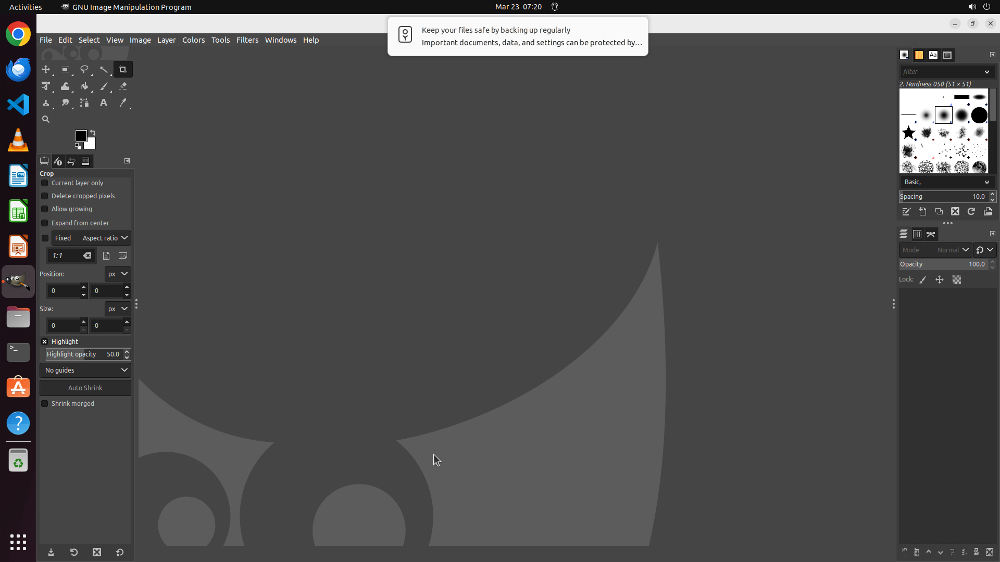

# Set the minimum number of undo steps to 100.

[← GIMP](../README.md) · [← Showcase](../../README.md)

## Task

> Set the minimum number of undo steps to 100.

## Final state

## Artifacts

- [▶ Screen recording](recording.mp4) — full agent run
- [Trajectory](traj.jsonl) — per-step actions, reasoning, and screenshots
- [Runtime log](runtime.log)
- [Task definition](task.json) — original OSWorld task config
- Step screenshots: `step_*.png` in this folder

Task ID: `7b7617bd-57cc-468e-9c91-40c4ec2bcb3d` · Domain: `gimp` · Source: `https://www.youtube.com/watch?v=G_PjQAy0iiU`
