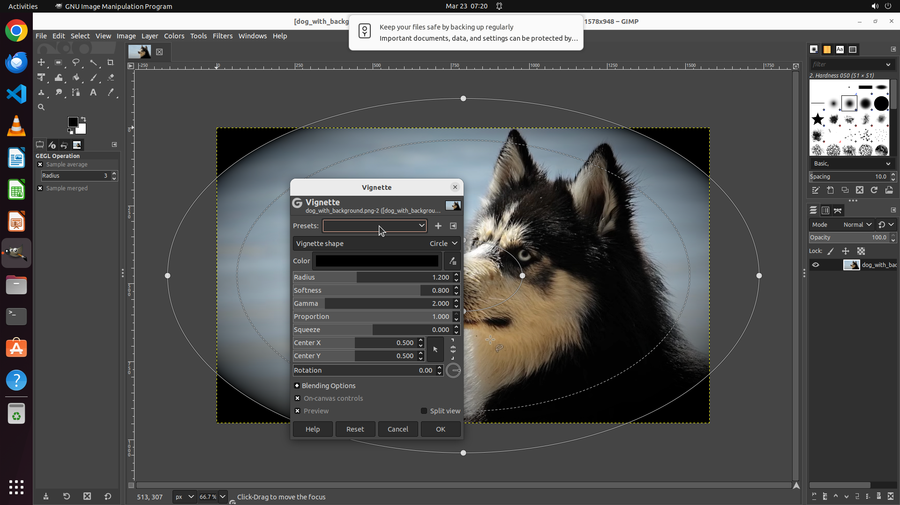

# Help me open up the Vignette filter window.

[← GIMP](../README.md) · [← Showcase](../../README.md)

## Task

> Help me open up the Vignette filter window.

## Final state

## Artifacts

- [▶ Screen recording](recording.mp4) — full agent run
- [Trajectory](traj.jsonl) — per-step actions, reasoning, and screenshots
- [Runtime log](runtime.log)
- [Task definition](task.json) — original OSWorld task config
- Step screenshots: `step_*.png` in this folder

Task ID: `a746add2-cab0-4740-ac36-c3769d9bfb46` · Domain: `gimp` · Source: `https://www.youtube.com/watch?v=_L_MMU22bAw`
